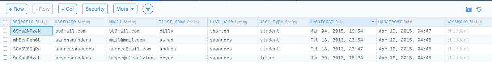
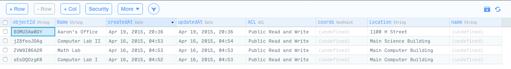
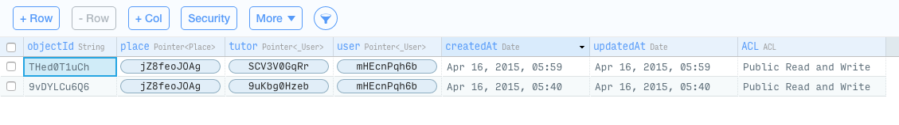

[](http://appcelerator.com/titanium/) [](http://appcelerator.com/alloy/)
____
#Appcelerator Titanium Alloy Mobile - Parse Starter Template w/REST Service

This approach differs from the previous template in that we focus on using the [Parse REST API](https://www.parse.com/docs/rest) instead of the JavaScript API. The work is is [based on work done by Stephen Feather](https://gist.github.com/sfeather/4400387) and other on creating the initial gist that I have derived the parseREST service from. I have made additional updates to the parseREST service and will continue to make changes to the application to make for a better starter template as an alternative to Appcelerator Cloud Services

Subscribe to the video channel [Beginning Appcelerator Titanium Alloy - Video Channel](https://www.youtube.com/channel/UCMCcqbJpyL3LAv3PJeYz2bg), for additional updates on this and other Appcelerator Services and Templates

###Working with the Service
Please note that this implementation does not require a sync adapter, the service returns javascript objects. If you want to use the data-binding capabilities of Appcelerator Titanium Alloy, you can always just create a Model or Collection with the results
````Javascript
// add library to project
var parseService = require('parseREST');

// set the API Credentials
parseService.init({
    appId : '',
    apiKey : ''
});
````
###Working with Users
Logging in a existing user; notice the integration of promises into the service to provide for a cleaner architecture
````Javascript
parseService.loginUser("aaronsaunders", "password").then(function(_result) {
    console.log(JSON.stringify(_result, null, 2));
}, function(_error){
    Ti.API.error('ERROR: ' + JSON.stringify(_error, null, 2));
});
````
If you have logged in previously, you can restore the user's session without logging in
````Javascript
parseService.restoreUser().then(function(_result) {
    console.log(JSON.stringify(_result, null, 2));
}, function(_error){
    Ti.API.error('ERROR: No session currently exists - ' + JSON.stringify(_error, null, 2));
});
````
###Working with Objects
[See objects below](#screenshot-of-tutor-sessions-objects); but querying the objects are pretty straight forward and url parameters that are documented in the [Parse REST API documentation](https://www.parse.com/docs/rest) can be passed in using the `urlparams` property on the `params` method variable
````Javascript
var _urlparams = {
    include : 'user,tutor,place', // return child objects for relationships
    limit : 5                     // only return the first 5 elements
};
var params = {
    'urlparams' : _urlparams
};
parseService.getObjects('TutorSession', params).then(function(_queryResult){
  _.each(_queryResult.response.results, function(element) {
    // log information about the tutoring session
    console.log("Tutor: " + element.tutor.first_name + " " + element.tutor.last_name);
    console.log("Location: " + element.place.Location + ", " + element.place.Name);
  });
}, function(_error){
    console.log("Some Error Happened: " + JSON.stringify(_error));
});
````
As mentioned above, if you want to work with Alloy Collections, you can just set the Collection with the results
``` Javascript
var collection  =  Alloy.createColllection('Sessions',_queryResult.response.results);
```
####Screenshot of Users Objects
[](http://appcelerator.com/alloy/)

####Screenshot of Places Objects
[](http://appcelerator.com/alloy/)

####Screenshot of Tutor Sessions Objects
[](http://appcelerator.com/alloy/)

###Working with Files
When workinf with Files in Parse, you have to remember that the only way to get access to the File object after it is created is to associate it with another object. In the example below, we will do this in two steps, first show how to create the file, and then show how to associate it with an object.

``` Javascript
var parseService = require('parseREST');
parseService.init();

file = Ti.Filesystem.getFile(Ti.Filesystem.resourcesDirectory, "iTunesConnect.png");
var blob = file.read();

parseService.uploadFile("image/jpeg", "iTunesConnect.png", blob);
```
This code will give you back a response object something like this and the file is floating out there in parse and there  is not real way to get the image back.

``` Javascript
{
    "name":"tfss-e74daf28-690a-4527-8c64-f99e5641b6e5-iTunesConnect.png",
    "url":"http://files.parsetfss.com/f875e1c9-4326-4040-afd8-19849220/tfss-e74daf28-iTunesConnect.png"
}
```
A helper method with allow you to upload the file and associate it with a specific object called a FileHelper. This `FileHelper` object will provide access to the image
```Javascript
var parseService = require('parseREST');
parseService.init();

file = Ti.Filesystem.getFile(Ti.Filesystem.resourcesDirectory, "iTunesConnect.png");
var blob = file.read();

parseService.uploadFile("image/jpeg", "iTunesConnect.png", blob).then(function(_results) {
	return parseService.createObject('FileHelper', {
		"nameKey" : _results.response.name,
		"fileData" : {
			"name" : _results.response.name,
			"__type" : "File"
		}
}).then(function(_results2) {
	console.log("FileHelper Object: " + JSON.stringify(_results2));
},function(_error)
    console.log("ERROR: " + JSON.stringify(_error));
});
```
The results should look something like this:
```
{
    "createdAt": "2015-05-11T15:30:52.004Z",
    "objectId": "yLPdeXDinq"
}
```
----------------------------------

Appcelerator, Appcelerator Titanium and associated marks and logos are 
trademarks of Appcelerator, Inc. 

Titanium is Copyright (c) 2008-2015 by Appcelerator, Inc. All Rights Reserved.

Titanium is licensed under the Apache Public License (Version 2). Please
see the LICENSE file for the full license.

